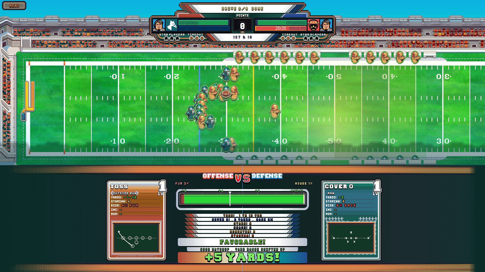
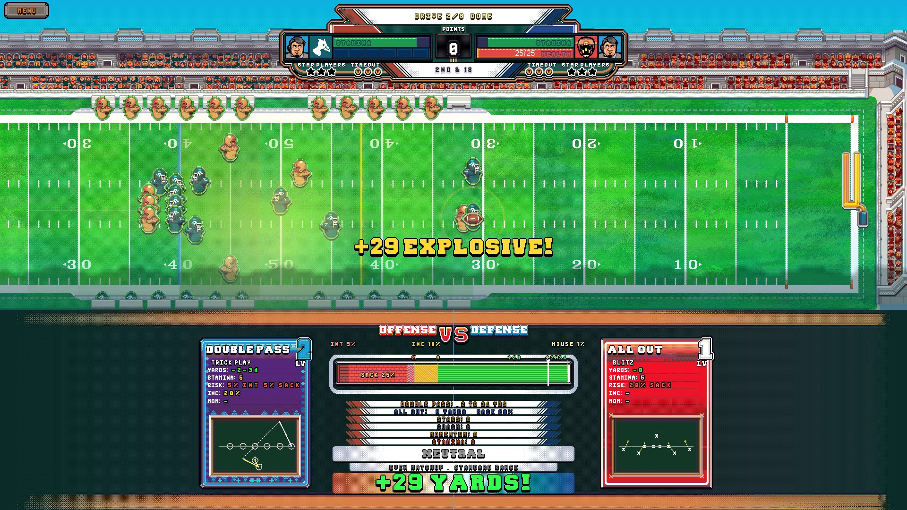
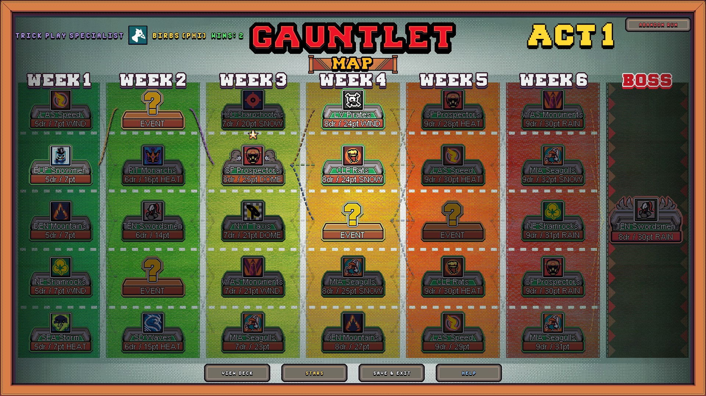
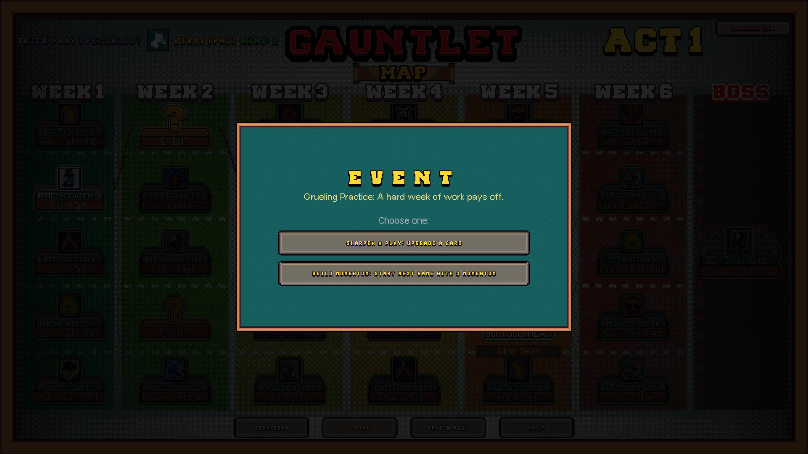
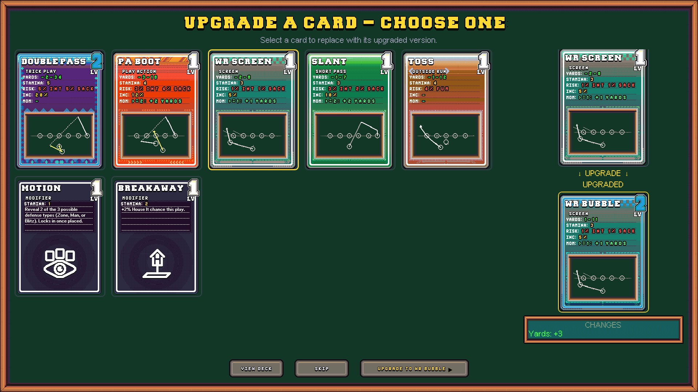
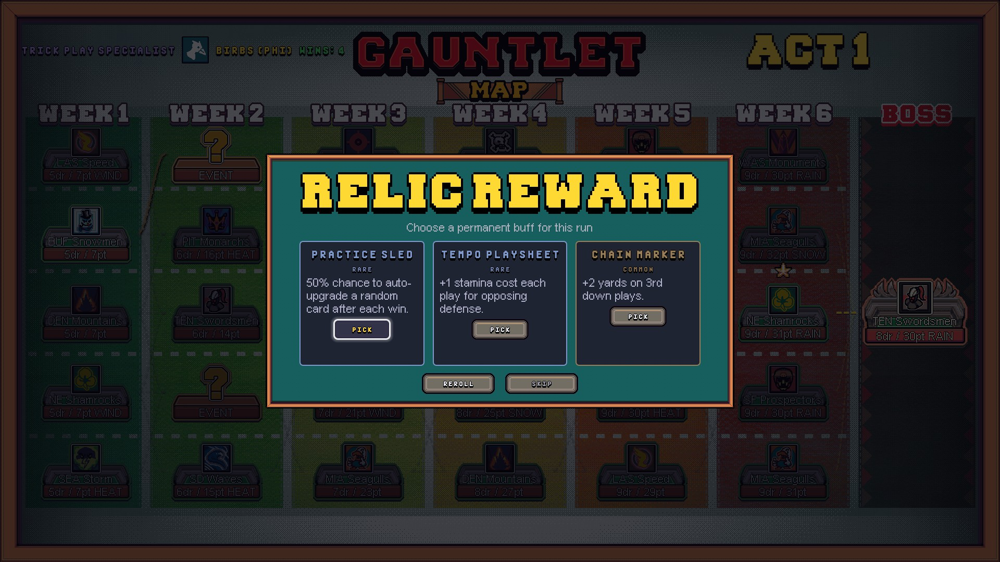
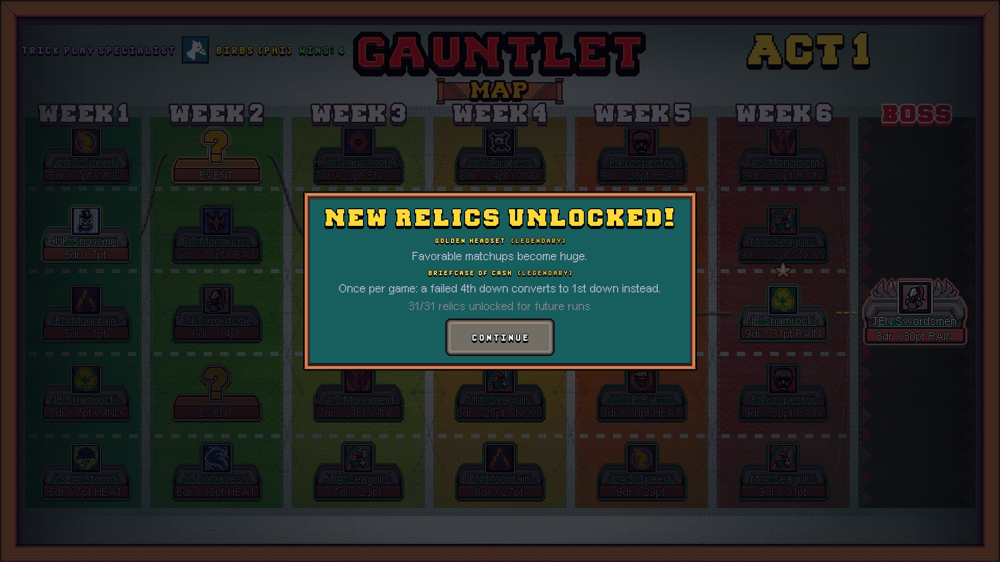
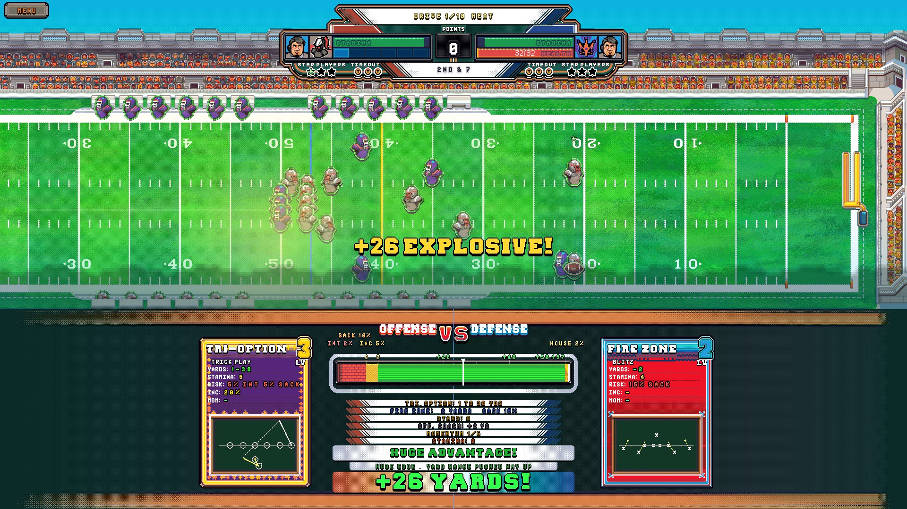
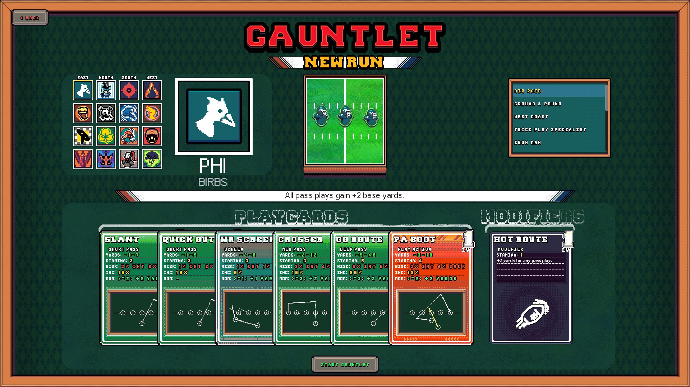
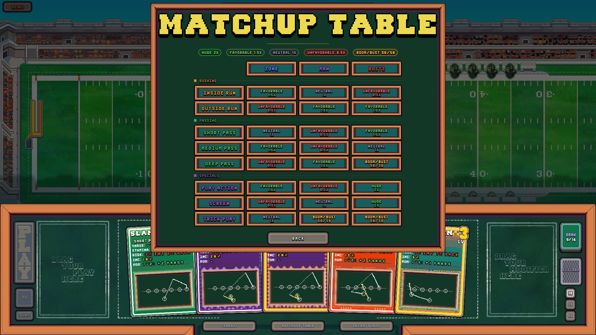

# FOURTH & GOAL — PRESS KIT

A football roguelike deckbuilder from JustinSane Games

>>> FREE DEMO ON STEAM JUNE 12 <<<
Playable during Steam Next Fest, June 15-22, 2026.

-----------------------------------------------------------
FACT SHEET
-----------------------------------------------------------

| | |
|---|---|
| **Title** | Fourth & Goal |
| **Developer** | JustinSane Games (solo developer) |
| **Platforms** | Steam (Windows, macOS, Linux) |
| **Demo** | June 12, 2026 (free, live through Steam Next Fest) |
| **Release** | July 2026 |
| **Price** | $17.99 USD 15% off launch discount |
| **Players** | Single-player |
| **Steam App ID** | 4466560 |
| **Steam page** | https://store.steampowered.com/app/4466560/4th__Goal/ |
| **Press contact** | contact.justinsanegames@gmail.com |

-----------------------------------------------------------
THE SHORT VERSION
-----------------------------------------------------------

Fourth & Goal is what happens when a roguelike deckbuilder and
American football collide. Draft plays, sign star players, collect relics and
out-scheme the defense on your run through the Gauntlet.

-----------------------------------------------------------
THE LONGER VERSION
-----------------------------------------------------------

In Fourth & Goal, every snap is a card battle. You pick a coach,
build a deck of plays, and call your shots — each down, you and
your opponent secretly pick a play (plus a modifier if you're
feeling clever), then watch it play out on a living top-down
field. Did your screen pass catch their blitz? Huge gain. Did
your deep ball run into man coverage? That's going to hurt.

Scheme matchups decide a lot, but so do your coach's perks, the
star players you've signed, stamina, momentum, and even the
weather. There's a real playbook under the hood — 8 offensive
play styles against 3 defensive schemes.

The Gauntlet is the main event: a 3-act branching run, roughly
21 nodes from kickoff to the final boss. Push through games,
rivals, and strange events, drafting and upgrading cards between
nodes. Score enough points before your drives run out — one loss
ends the run. Clear Act 3 and you can go Infinite: an endless
streak mode with a Steam leaderboard, where the run lasts only
as long as every single drive ends in a touchdown.

Want the full sideline experience? Season Mode puts you on both
sides of the ball — separate offensive and defensive decks,
12 games, star players to manage, and a Mega Bowl to win. There's
also Exhibition for quick one-off games and a Tutorial that
teaches you the playbook.

For fans of Slay the Spire, Balatro, Clutchtime, etc.

-----------------------------------------------------------
KEY FEATURES
-----------------------------------------------------------

* Play-calling as a card battle. Secret play + modifier selection,
  resolved on an animated field. The 8x3 scheme matchup table
  decides who wins the down.

* The Gauntlet: 3-act branching roguelike runs, plus an endless
  Infinite Mode with a Steam leaderboard.
  
* Coach both sides of the ball. Season Mode has you building and
  upgrading separate offense and defense decks.

* 168 cards across 3 upgrade tiers — plays, modifiers, and elite
  versions to draft, upgrade, and cut.

* 20 coaches and 39 star players, each with their own passives
  and synergies. Assemble a Hall of Fame roster.

* 30 run-spanning relics for permanent, build-defining buffs.

* Systems with teeth: stamina, momentum, weather, and an adaptive
  AI that learns your tendencies and starts calling counters.

* Full controller support, Steam achievements, rebindable
  keyboard and gamepad controls, and adjustable game speed.

-----------------------------------------------------------
GAME MODES
-----------------------------------------------------------

GAUNTLET — The flagship roguelike. Offense only: navigate a
3-act branching map (6 rows of games, rivals, events, and bye
weeks per act, capped by an act boss), scoring target points
within a limited number of drives. One loss ends the run. Clear
Act 3 to unlock Infinite Mode.

SEASON — Coach offense AND defense across a 12-game season.
Draft cards between games, sign star players, survive your
rivals, and push through the playoffs to the Mega Bowl.

EXHIBITION — Quick one-off matchups when you just want to play
football.

-----------------------------------------------------------
TRAILER
-----------------------------------------------------------

[FILL IN: YouTube or Vimeo link — trailer still needs to be made]

Raw, uncut gameplay footage is available on request — just email.
Content creators often prefer footage they can talk over.

-----------------------------------------------------------
SCREENSHOTS
-----------------------------------------------------------

-----------------------------------------------------------
LOGO & KEY ART
-----------------------------------------------------------

-----------------------------------------------------------
ABOUT THE DEVELOPER
-----------------------------------------------------------

Fourth & Goal is the first work of JustinSane Games, a full time computer engineer who wanted to combine his love for Football and Roguelikes.

-----------------------------------------------------------
LINKS & PRESS COPIES
-----------------------------------------------------------

| | |
|---|---|
| **Steam / Wishlist** | https://store.steampowered.com/app/4466560/4th__Goal/ |
| **Website** | https://github.com/JustinSane21/Justinsane21.github.io/blob/main/README.md |
| **Discord** | https://discord.gg/yueNYce8tm |

Press copies: Steam keys are available on request. Email
contact.justinsanegames@gmail.com and mention your outlet or
channel.
